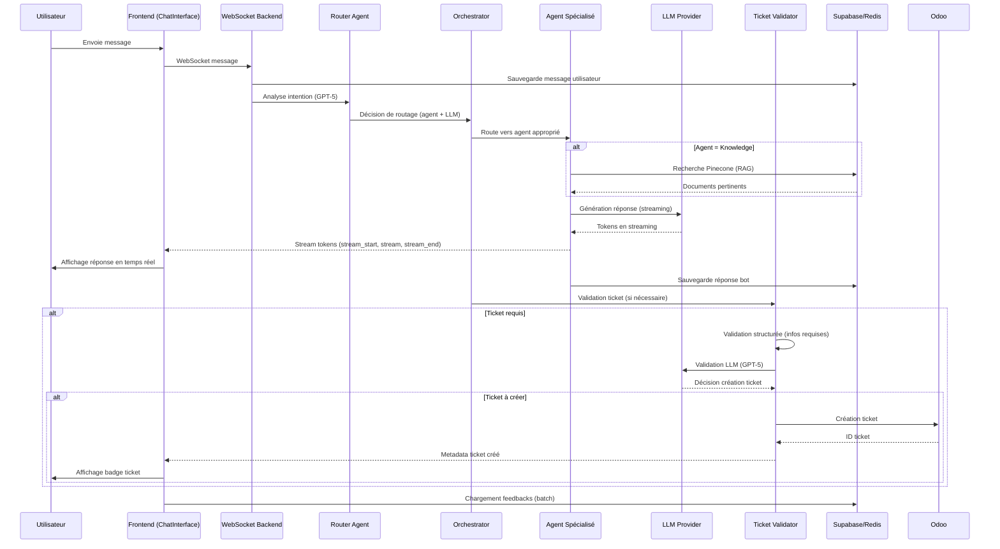
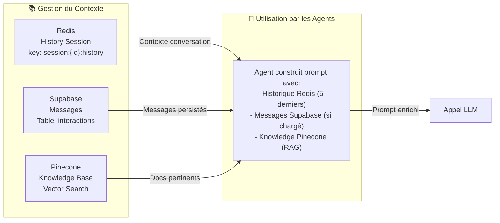
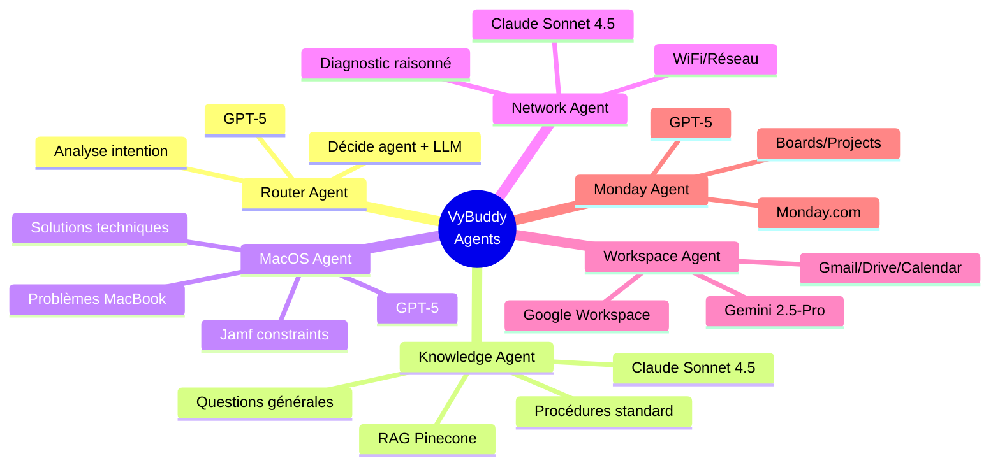
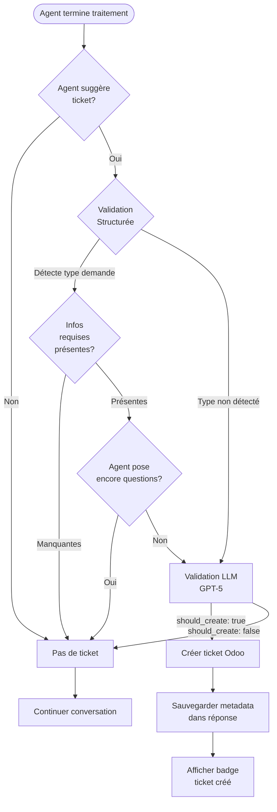
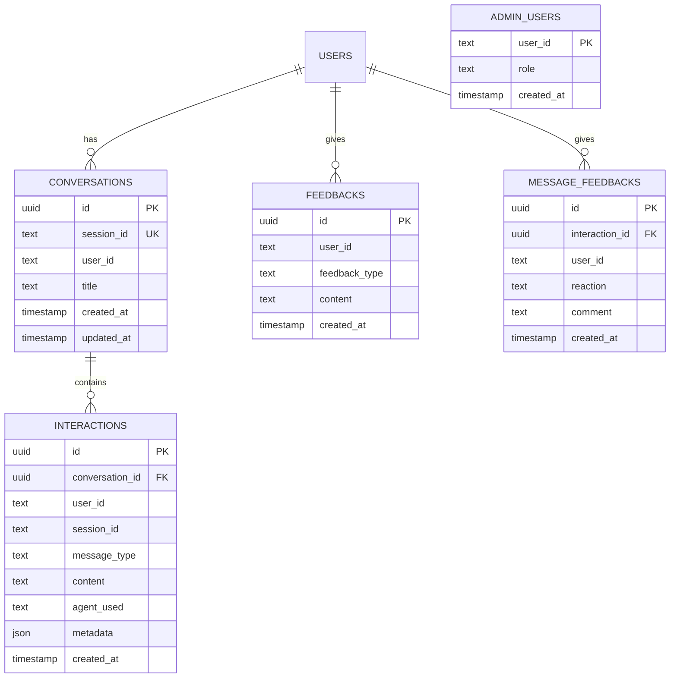

# Diagramme d'Architecture - VyBuddy Rebirth

## Architecture globale

```mermaid
graph TB
    %% Frontend
    subgraph Frontend["🌐 Frontend (Next.js)"]
        UI["Interface Utilisateur<br/>ChatInterface.tsx"]
        Sidebar["Sidebar<br/>Historique Conversations"]
        Auth["NextAuth.js<br/>Google SSO"]
    end

    %% Backend API
    subgraph Backend["⚙️ Backend (FastAPI)"]
        WS["WebSocket Endpoint<br/>/ws/{session_id}"]
        API["REST API<br/>/api/v1"]
        
        subgraph Routing["🔀 Routage Intelligent"]
            Router["Router Agent<br/>GPT-5"]
        end
        
        subgraph Agents["🤖 Agents Spécialisés"]
            KnowledgeAgent["Knowledge Agent<br/>Anthropic Claude<br/>Procédures/RAG"]
            MacOSAgent["MacOS Agent<br/>OpenAI GPT-5<br/>Problèmes MacBook"]
            NetworkAgent["Network Agent<br/>Anthropic Claude<br/>WiFi/Réseau"]
            WorkspaceAgent["Workspace Agent<br/>Gemini 2.5-Pro<br/>Google Workspace"]
            MondayAgent["Monday Agent<br/>OpenAI GPT-5<br/>Monday.com"]
        end
        
        subgraph Validation["✅ Validation"]
            TicketValidator["Ticket Validator<br/>GPT-5<br/>Validation structurée + LLM"]
        end
        
        subgraph Services["🔧 Services"]
            Orchestrator["Orchestrator<br/>LangGraph Swarm"]
            TicketService["Ticket Service<br/>Odoo Integration"]
        end
    end

    %% Bases de données
    subgraph Databases["💾 Bases de Données"]
        Supabase["Supabase<br/>- Conversations<br/>- Messages<br/>- Feedbacks<br/>- Tickets<br/>- Users"]
        Redis["Redis<br/>Session History<br/>Cache"]
        Pinecone["Pinecone<br/>Vector DB<br/>Knowledge Base"]
    end

    %% Services externes
    subgraph External["🌍 Services Externes"]
        Odoo["Odoo<br/>Ticketing System"]
        Google["Google Workspace<br/>API"]
    end

    %% Flux Frontend -> Backend
    UI -->|WebSocket| WS
    UI -->|REST API| API
    Auth -->|JWT Token| WS
    Auth -->|JWT Token| API

    %% Flux Backend interne
    WS -->|Message Utilisateur| Router
    Router -->|Décision Routage| Orchestrator
    Orchestrator -->|Route| KnowledgeAgent
    Orchestrator -->|Route| MacOSAgent
    Orchestrator -->|Route| NetworkAgent
    Orchestrator -->|Route| WorkspaceAgent
    Orchestrator -->|Route| MondayAgent
    
    %% Agents -> LLMs
    KnowledgeAgent -->|Claude Sonnet 4.5| AnthropicAPI["Anthropic API"]
    MacOSAgent -->|GPT-5| OpenAIAPI["OpenAI API"]
    NetworkAgent -->|Claude Sonnet 4.5| AnthropicAPI
    WorkspaceAgent -->|Gemini 2.5-Pro| GeminiAPI["Google Gemini API"]
    MondayAgent -->|GPT-5| OpenAIAPI
    Router -->|GPT-5| OpenAIAPI
    
    %% Agents -> Bases de données
    KnowledgeAgent -->|Recherche Vecteurs| Pinecone
    MacOSAgent -->|Recherche Vecteurs| Pinecone
    NetworkAgent -->|Recherche| Pinecone
    
    %% Validation tickets
    Orchestrator -->|Validation| TicketValidator
    TicketValidator -->|GPT-5| OpenAIAPI
    TicketValidator -->|Info Requises| TicketService
    
    %% Sauvegarde données
    WS -->|Save Messages| Supabase
    WS -->|Save History| Redis
    Orchestrator -->|Save Interactions| Supabase
    
    %% Tickets
    TicketService -->|Create Ticket| Odoo
    
    %% API REST
    API -->|Feedbacks| Supabase
    API -->|Conversations| Supabase
    API -->|Messages| Supabase
    
    %% Streaming
    KnowledgeAgent -.->|Stream Response| WS
    MacOSAgent -.->|Stream Response| WS
    NetworkAgent -.->|Stream Response| WS
    WorkspaceAgent -.->|Stream Response| WS
    MondayAgent -.->|Stream Response| WS

    %% Styling
    classDef frontend fill:#e1f5ff,stroke:#01579b,stroke-width:2px
    classDef backend fill:#fff3e0,stroke:#e65100,stroke-width:2px
    classDef database fill:#f3e5f5,stroke:#4a148c,stroke-width:2px
    classDef external fill:#e8f5e9,stroke:#1b5e20,stroke-width:2px
    classDef agent fill:#fff9c4,stroke:#f57f17,stroke-width:2px
    classDef llm fill:#fce4ec,stroke:#880e4f,stroke-width:2px
    
    class UI,Sidebar,Auth frontend
    class WS,API,Router,Orchestrator,TicketValidator,TicketService backend
    class Supabase,Redis,Pinecone database
    class Odoo,Google external
    class KnowledgeAgent,MacOSAgent,NetworkAgent,WorkspaceAgent,MondayAgent agent
    class OpenAIAPI,AnthropicAPI,GeminiAPI llm
```

## Flux de traitement d'un message

## Gestion du contexte

## Agents et leurs rôles

## Système de validation des tickets

## Bases de données - Schéma simplifié

