# Diagramme d'Architecture - VyBuddy Rebirth

## Architecture globale

```mermaid
graph TB
    %% Frontend
    subgraph Frontend["🌐 Frontend (Next.js)"]
        UI["Interface Utilisateur<br/>ChatInterface.tsx"]
        Sidebar["Sidebar<br/>Historique Conversations"]
        Auth["NextAuth.js<br/>Google SSO"]
    end

    %% Backend API
    subgraph Backend["⚙️ Backend (FastAPI)"]
        WS["WebSocket Endpoint<br/>/ws/{session_id}"]
        API["REST API<br/>/api/v1"]
        
        subgraph Routing["🔀 Routage Intelligent"]
            Router["Router Agent<br/>GPT-5"]
        end
        
        subgraph Agents["🤖 Agents Spécialisés"]
            KnowledgeAgent["Knowledge Agent<br/>Anthropic Claude<br/>Procédures/RAG"]
            MacOSAgent["MacOS Agent<br/>OpenAI GPT-5<br/>Problèmes MacBook"]
            NetworkAgent["Network Agent<br/>Anthropic Claude<br/>WiFi/Réseau"]
            WorkspaceAgent["Workspace Agent<br/>Gemini 2.5-Pro<br/>Google Workspace"]
            MondayAgent["Monday Agent<br/>OpenAI GPT-5<br/>Monday.com"]
        end
        
        subgraph Validation["✅ Validation"]
            TicketValidator["Ticket Validator<br/>GPT-5<br/>Validation structurée + LLM"]
        end
        
        subgraph Services["🔧 Services"]
            Orchestrator["Orchestrator<br/>LangGraph Swarm"]
            TicketService["Ticket Service<br/>Odoo Integration"]
        end
    end

    %% Bases de données
    subgraph Databases["💾 Bases de Données"]
        Supabase["Supabase<br/>- Conversations<br/>- Messages<br/>- Feedbacks<br/>- Tickets<br/>- Users"]
        Redis["Redis<br/>Session History<br/>Cache"]
        Pinecone["Pinecone<br/>Vector DB<br/>Knowledge Base"]
    end

    %% Services externes
    subgraph External["🌍 Services Externes"]
        Odoo["Odoo<br/>Ticketing System"]
        Google["Google Workspace<br/>API"]
    end

    %% Flux Frontend -> Backend
    UI -->|WebSocket| WS
    UI -->|REST API| API
    Auth -->|JWT Token| WS
    Auth -->|JWT Token| API

    %% Flux Backend interne
    WS -->|Message Utilisateur| Router
    Router -->|Décision Routage| Orchestrator
    Orchestrator -->|Route| KnowledgeAgent
    Orchestrator -->|Route| MacOSAgent
    Orchestrator -->|Route| NetworkAgent
    Orchestrator -->|Route| WorkspaceAgent
    Orchestrator -->|Route| MondayAgent
    
    %% Agents -> LLMs
    KnowledgeAgent -->|Claude Sonnet 4.5| AnthropicAPI["Anthropic API"]
    MacOSAgent -->|GPT-5| OpenAIAPI["OpenAI API"]
    NetworkAgent -->|Claude Sonnet 4.5| AnthropicAPI
    WorkspaceAgent -->|Gemini 2.5-Pro| GeminiAPI["Google Gemini API"]
    MondayAgent -->|GPT-5| OpenAIAPI
    Router -->|GPT-5| OpenAIAPI
    
    %% Agents -> Bases de données
    KnowledgeAgent -->|Recherche Vecteurs| Pinecone
    MacOSAgent -->|Recherche Vecteurs| Pinecone
    NetworkAgent -->|Recherche| Pinecone
    
    %% Validation tickets
    Orchestrator -->|Validation| TicketValidator
    TicketValidator -->|GPT-5| OpenAIAPI
    TicketValidator -->|Info Requises| TicketService
    
    %% Sauvegarde données
    WS -->|Save Messages| Supabase
    WS -->|Save History| Redis
    Orchestrator -->|Save Interactions| Supabase
    
    %% Tickets
    TicketService -->|Create Ticket| Odoo
    
    %% API REST
    API -->|Feedbacks| Supabase
    API -->|Conversations| Supabase
    API -->|Messages| Supabase
    
    %% Streaming
    KnowledgeAgent -.->|Stream Response| WS
    MacOSAgent -.->|Stream Response| WS
    NetworkAgent -.->|Stream Response| WS
    WorkspaceAgent -.->|Stream Response| WS
    MondayAgent -.->|Stream Response| WS

    %% Styling
    classDef frontend fill:#e1f5ff,stroke:#01579b,stroke-width:2px
    classDef backend fill:#fff3e0,stroke:#e65100,stroke-width:2px
    classDef database fill:#f3e5f5,stroke:#4a148c,stroke-width:2px
    classDef external fill:#e8f5e9,stroke:#1b5e20,stroke-width:2px
    classDef agent fill:#fff9c4,stroke:#f57f17,stroke-width:2px
    classDef llm fill:#fce4ec,stroke:#880e4f,stroke-width:2px
    
    class UI,Sidebar,Auth frontend
    class WS,API,Router,Orchestrator,TicketValidator,TicketService backend
    class Supabase,Redis,Pinecone database
    class Odoo,Google external
    class KnowledgeAgent,MacOSAgent,NetworkAgent,WorkspaceAgent,MondayAgent agent
    class OpenAIAPI,AnthropicAPI,GeminiAPI llm
```

## Flux de traitement d'un message

```mermaid
sequenceDiagram
    participant U as Utilisateur
    participant F as Frontend (ChatInterface)
    participant WS as WebSocket Backend
    participant R as Router Agent
    participant O as Orchestrator
    participant A as Agent Spécialisé
    participant LLM as LLM Provider
    participant TV as Ticket Validator
    participant DB as Supabase/Redis
    participant ODOO as Odoo

    U->>F: Envoie message
    F->>WS: WebSocket message
    WS->>DB: Sauvegarde message utilisateur
    WS->>R: Analyse intention (GPT-5)
    R->>O: Décision de routage (agent + LLM)
    O->>A: Route vers agent approprié
    
    alt Agent = Knowledge
        A->>DB: Recherche Pinecone (RAG)
        DB-->>A: Documents pertinents
    end
    
    A->>LLM: Génération réponse (streaming)
    LLM-->>A: Tokens en streaming
    A-->>F: Stream tokens (stream_start, stream, stream_end)
    F->>U: Affichage réponse en temps réel
    
    A->>DB: Sauvegarde réponse bot
    O->>TV: Validation ticket (si nécessaire)
    
    alt Ticket requis
        TV->>TV: Validation structurée (infos requises)
        TV->>LLM: Validation LLM (GPT-5)
        LLM-->>TV: Décision création ticket
        alt Ticket à créer
            TV->>ODOO: Création ticket
            ODOO-->>TV: ID ticket
            TV-->>F: Metadata ticket créé
            F->>U: Affichage badge ticket
        end
    end
    
    F->>DB: Chargement feedbacks (batch)
```

## Gestion du contexte

## Agents et leurs rôles

```mermaid
mindmap
  root((VyBuddy<br/>Agents))
    Router Agent
      GPT-5
      Analyse intention
      Décide agent + LLM
    Knowledge Agent
      Claude Sonnet 4.5
      Procédures standard
      RAG Pinecone
      Questions générales
    MacOS Agent
      GPT-5
      Problèmes MacBook
      Solutions techniques
      Jamf constraints
    Network Agent
      Claude Sonnet 4.5
      WiFi/Réseau
      Diagnostic raisonné
    Workspace Agent
      Gemini 2.5-Pro
      Google Workspace
      Gmail/Drive/Calendar
    Monday Agent
      GPT-5
      Monday.com
      Boards/Projects
```

## Système de validation des tickets

```mermaid
flowchart TD
    Start([Agent termine traitement]) --> Check1{Agent suggère<br/>ticket?}
    
    Check1 -->|Non| NoTicket[Pas de ticket]
    Check1 -->|Oui| StructCheck{Validation<br/>Structurée}
    
    StructCheck -->|Détecte type demande| CheckInfo{Infos<br/>requises<br/>présentes?}
    StructCheck -->|Type non détecté| LLMCheck
    
    CheckInfo -->|Manquantes| NoTicket
    CheckInfo -->|Présentes| CheckQuestion{Agent pose<br/>encore questions?}
    
    CheckQuestion -->|Oui| NoTicket
    CheckQuestion -->|Non| LLMCheck[Validation LLM<br/>GPT-5]
    
    LLMCheck -->|should_create: true| CreateTicket[Créer ticket Odoo]
    LLMCheck -->|should_create: false| NoTicket
    
    CreateTicket --> SaveMetadata[Sauvegarder metadata<br/>dans réponse]
    SaveMetadata --> Frontend[Afficher badge<br/>ticket créé]
    
    NoTicket --> Continue[Continuer conversation]
```

## Bases de données - Schéma simplifié

